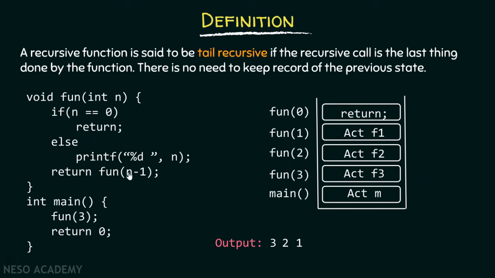
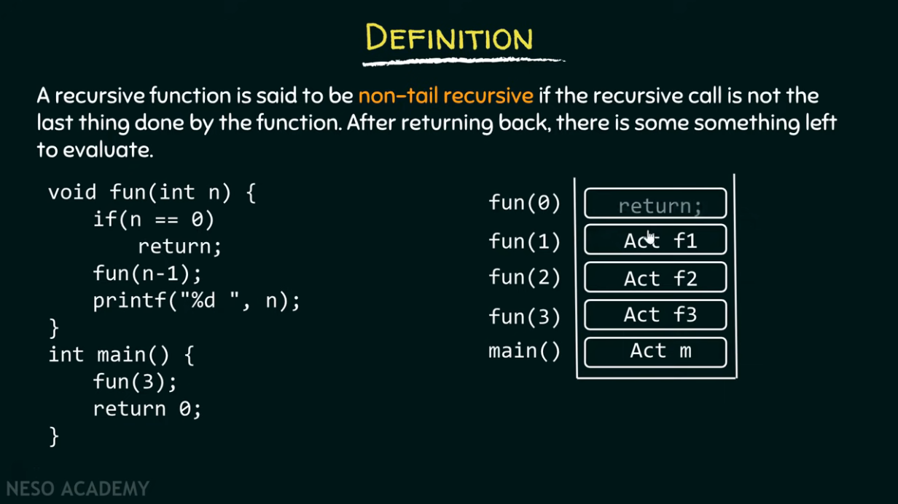

# Recursion and Backtracking

This is prepared with the help of materials from the following sources:

-   [MIT Lecture Notes on Recursion](https://web.mit.edu/6.005/www/fa16/classes/14-recursion/)
-   [Recursion Playlist by TakeUForward](https://www.youtube.com/playlist?list=PLgUwDviBIf0rGlzIn_7rsaR2FQ5e6ZOL9)
-   Some screenshots are from [Neso Academy on Youtube](https://www.youtube.com/c/nesoacademy)

## Introduction and Useful Points

-   Any function which calls itself is called recursive.
-   A recursive method (recursive function) solves a problem by calling a copy of itself. When the call ends, the copy of that returning method is removed from that memory.
-   When a recursive call happens, all the previous function calls keep waiting in the stack memory.
-   Therefore, it's important to terminate a recursive method. Else, there will be a memory overflow.
-   A recursive function calls itself with a slightly better/solved/simpler version of the problem.
-   The smaller problems should terminate or converge on the base case. At the base case, the function encounters a subtask which it can solve without calling itself.

<br>

## Some Examples

#### Print "NAME" n times using recursion.

```java
public class PrintName {
    static void print(int i, int n) {
        if (i > n) return;

        System.out.println("NAME");
        print(i+1, n);

        // Notice the extra parameter 'i'
        // being used to measure the recursive calls.
        // This is called parameterized recursion.
    }

    public static void main(Sting[] args) {
        Scanner sc = new Scanner;
        int n = sc.nextInt(); // take the input for number
        //of times function will run

        print(1, n); // call the function
        //print to print name "n" times.
    }
}
```

#### Print N to 1 using recursion.

```java
public class PrintName {
    static void print(int n) {
        if (n < 1) return;

        System.out.println(n);
        print(n-1);

        // Notice there are no extra parameters
        // in the function call other than 'n'.
        // This is functional recursion.
    }

    public static void main(Sting[] args) {
        Scanner sc = new Scanner;
        int n = sc.nextInt(); // take the input for
        //number of times function will run

        print(n); // call the function print to print
        //n to 1.
    }
}

```

<br>

## Types of Recursion

There are four types of recursion:

1. Direct Recursion
2. Indirect Recursion
3. Tail Recursion
4. Non-Tail Recursion

_For reference please visit [1](https://www.youtube.com/watch?v=t9whckmAEq0), [2](https://www.youtube.com/watch?v=HIt_GPuD7wk)_

**Direct Recursion**

> A function is called direct recursive if it calls the same function again.

**Indirect Recursion**

> A function (say f1) is called indirect recursive if it calls a function f2, which calls f1 directly or indirectly. There can be more than two functions involved in an indirect recursion.

**Tail Recursion**

> A function is called tail recursive, if the recursive call is the last thing done by the function. There is no need to keep record of the previous state.
> 
> Note: In the fun(0) line when function simply returns, the control to fun(1) comes back to last line `return fun(n-1)` after which there is no work to be done. Therefore no record of previous state.
> PS. Stack assumes that there is some work left in fun(1) ... fun(2) that's why it keeps them in record.

**Non-Tail Recursion**

> A function is called tail recursive, if the recursive call is **not** the last thing done by the function. After returning the function call there is some work to evaluate.
> 
> After calling the return on fun(0), control will come back to fun(1) where it'll evaluate the lines `printf("%d", n);`

Note: **Important Example of a Non-tail Recursive Function**

```C

int fun(int n) {
    if (n == 1)
        return;
    else
        return 1+fun(n/2);
}

int main() {
    printf("%d", fun(8));
    return 0;
}
```

This is a non-tail recursive function as in the else statement, `1+fun(n/2)` 1+ needs to be evaluated. Therefore, keep tracking of pending calculations.

<br>

## Recursive functions with multiple recursive calls.

Let's take the classical example of Fibonacci series.
_For reference [read here](https://www.inf.unibz.it/~calvanese/teaching/04-05-ip/lecture-notes/uni10/node23.html)_

```Java
public static long fib(long n) {
  if (n < 0) return -1;  // F(n) is not defined when n is negative
  if (n == 0)
    return 0;
  else if (n == 1)
    return 1;
  else
    return fib(n-2) + fib(n-1);
}

```

It's recursive tree would look like (for fib(6)):

> 
> For multiple recursion calls, which comes first is calculated and returned, and then when the control comes to the original function (which initiated the calls[not main]). Then it calls the next recursion and so on ...
> Note. tree first operates on n-2 then calls n-1. As in the code and the image.

_For more read these: [1](https://www.quora.com/How-do-functions-with-two-recursive-calls-work), [2](https://stackoverflow.com/questions/29312260/difficulty-understanding-multiple-recursive-calls), [3]()_

<br>

## Recursion on subsequences

**Printing subsequences**

Subsequences are part of the array that have the same sequence as the original array. An empty array can also be a subsequence. In mathematics, a subsequence of a given sequence is a sequence that can be derived from the given sequence by deleting some or no elements without changing the order of the remaining elements.

E.g.

```
[3, 1, 2, 7, 0] is an Array (or sequence)

It's subsequence can be:
[3, 1, 2], [1, 2, 0], [7], [3, 0] ...

What subsequence cannot be:
[1, 2, 3], [0, 7, 1]... any change in order is not a subsequence.
```

In order to generate all subsequences, one can use the [power set algorithm](https://www.geeksforgeeks.org/power-set/) to do so.
